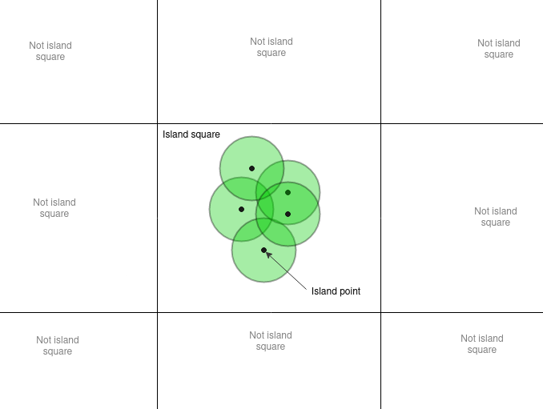

# Island Flyer

This game is an island explorer game. The game is made with OpenGl using LWJGL.

## Generation

The islands are procedurally generated, so the world you can explore is infinite.
The islands are generated using perlin noise as a base, and shaped using what I call “island points“ and “island squares”. Island points can only exist inside of an island square, and has a higher chance of existing closer to the center of the square. A given points height is defined by how close it is to an island point.

## How to run

There are executables [here](./executables). Read [this](./executables/Running.md) for more information about running the game.
